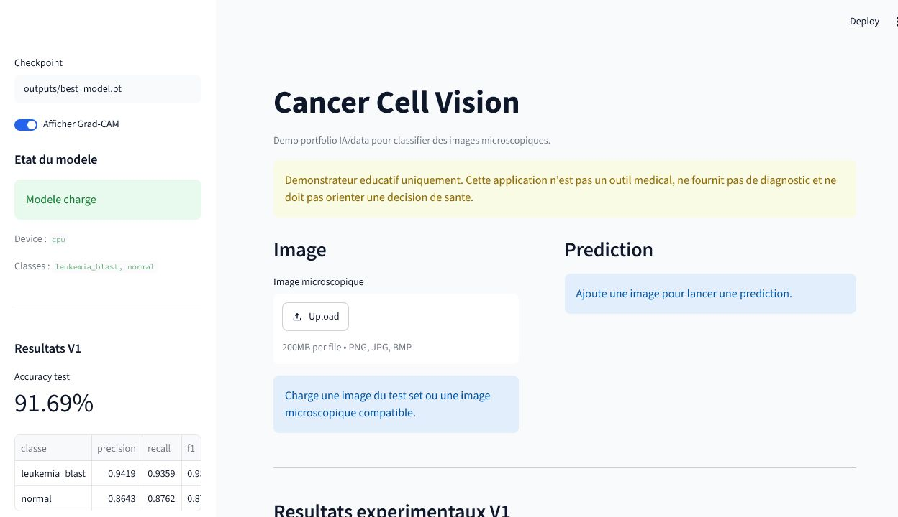

# Cancer Cell Vision

Projet portfolio IA/data de computer vision pour classifier des images microscopiques de cellules sanguines en deux classes : `normal` et `leukemia_blast`.

> Important : Cancer Cell Vision est un demonstrateur educatif. Il ne fournit pas de diagnostic medical, ne remplace pas un avis professionnel et ne doit jamais orienter une decision de sante.

## Resume

Cette V1 met en place une pipeline complete de classification d'images :

- preparation d'un dataset public Kaggle ;
- split `train` / `val` / `test` ;
- entrainement par transfer learning avec ResNet18 ;
- evaluation avec accuracy, precision, recall, F1-score et matrice de confusion ;
- prediction en ligne de commande ;
- interface Streamlit avec upload d'image, probabilites et Grad-CAM.

La demo locale a ete testee avec le checkpoint reel `outputs/best_model.pt`.

## Stack Technique

- Python
- PyTorch / Torchvision
- OpenCV
- Pandas / NumPy
- Scikit-learn
- Matplotlib
- Streamlit
- Grad-CAM
- Pytest

## Dataset V1

Dataset public utilise : **Kaggle - andrewmvd/leukemia-classification**.

Lien manuel : https://www.kaggle.com/datasets/andrewmvd/leukemia-classification

Images preparees :

| Classe | Images |
| --- | ---: |
| `normal` | 3389 |
| `leukemia_blast` | 7272 |

Split utilise :

| Classe | Train | Val | Test |
| --- | ---: | ---: | ---: |
| `normal` | 2372 | 508 | 509 |
| `leukemia_blast` | 5090 | 1090 | 1092 |

Les donnees locales restent ignorees par Git : `data/raw/`, `data/processed/`, `outputs/` et les checkpoints ne sont pas versionnes.

## Pipeline ML

```text
Dataset Kaggle
  -> preparation data/raw/normal + data/raw/leukemia_blast
  -> split data/processed/train|val|test
  -> entrainement ResNet18 transfer learning
  -> evaluation test set
  -> prediction CLI
  -> demo Streamlit + Grad-CAM
```

Baseline V1 :

- modele : ResNet18 en transfer learning ;
- entrainement : CPU, 5 epochs, batch size 16 ;
- checkpoint local : `outputs/best_model.pt` ;
- meilleure validation accuracy : `0.9168` ;
- test accuracy : `0.9169`.

## Resultats Experimentaux V1

Rapport de classification sur le test set :

| Classe | Precision | Recall | F1-score | Support |
| --- | ---: | ---: | ---: | ---: |
| `leukemia_blast` | 0.9419 | 0.9359 | 0.9389 | 1092 |
| `normal` | 0.8643 | 0.8762 | 0.8702 | 509 |
| `macro avg` | 0.9031 | 0.9061 | 0.9046 | 1601 |
| `weighted avg` | 0.9173 | 0.9169 | 0.9171 | 1601 |

Matrice de confusion test :

| Vraie classe / prediction | `leukemia_blast` | `normal` |
| --- | ---: | ---: |
| `leukemia_blast` | 1022 | 70 |
| `normal` | 63 | 446 |

Exemples de test Streamlit :

- `leukemia_blast_000004.bmp` -> prediction `leukemia_blast`, confiance `71.51%` ;
- `normal_000001.bmp` -> prediction `normal`, confiance `99.37%`.

Ces scores sont uniquement des resultats experimentaux de projet portfolio. Ils ne constituent pas une validation clinique.

## Demo Locale

Lancer l'application :

```powershell
.\.venv\Scripts\streamlit.exe run app.py
```

Dans l'interface :

- verifier que le modele `outputs/best_model.pt` est charge ;
- uploader une image depuis `data\processed\test\leukemia_blast` ou `data\processed\test\normal` ;
- lire la classe predite, la confiance et les probabilites ;
- afficher la visualisation Grad-CAM si disponible ;
- garder visible le disclaimer medical.

Captures recommandees pour le portfolio :

- page Streamlit avec modele charge ;
- prediction `leukemia_blast` avec Grad-CAM ;
- prediction `normal` avec probabilites.

La checklist detaillee est dans [docs/assets/README.md](docs/assets/README.md).

## Apercu De L'Application Streamlit

Page d'accueil avec checkpoint charge, disclaimer medical et resultats V1 :



Prediction `leukemia_blast` avec probabilites et visualisation Grad-CAM :


Prediction `normal` avec probabilites par classe :


## Architecture Du Projet

```text
.
|-- app.py
|-- cancer_cell_vision/
|   |-- dataset.py
|   |-- evaluate.py
|   |-- gradcam.py
|   |-- model.py
|   |-- predict.py
|   |-- train.py
|   `-- utils.py
|-- scripts/
|   |-- prepare_leukemia_dataset.py
|   |-- run_model_comparison.py
|   |-- setup_windows.bat
|   `-- split_image_folder.py
|-- docs/
|   |-- assets/
|   |   `-- README.md
|   |-- DATASET_GUIDE.md
|   |-- REAL_DATASET_V1.md
|   |-- SETUP_WINDOWS.md
|   `-- V2_MODEL_COMPARISON.md
|-- tests/
`-- requirements.txt
```

## Installation

Sur Windows :

```powershell
python -m venv .venv
.\.venv\Scripts\Activate.ps1
python -m pip install --upgrade pip
python -m pip install -r requirements.txt
python -m pip install -r requirements-dev.txt
```

Tu peux aussi consulter [docs/SETUP_WINDOWS.md](docs/SETUP_WINDOWS.md).

## Reproduire L'Experience

Configurer l'acces Kaggle localement hors du depot, puis telecharger le dataset :

```powershell
.\.venv\Scripts\python.exe -m pip install kaggle
New-Item -ItemType Directory -Force C:\VSCODE\datasets\leukemia-classification
.\.venv\Scripts\kaggle.exe datasets download -d andrewmvd/leukemia-classification -p C:\VSCODE\datasets\leukemia-classification --unzip
```

Preparer les dossiers `data/raw/normal` et `data/raw/leukemia_blast` :

```powershell
.\.venv\Scripts\python.exe scripts\prepare_leukemia_dataset.py --source C:\VSCODE\datasets\leukemia-classification\C-NMC_Leukemia\training_data --output data\raw --overwrite
```

Creer les splits :

```powershell
.\.venv\Scripts\python.exe scripts\split_image_folder.py --input data\raw --output data\processed --val-ratio 0.15 --test-ratio 0.15 --overwrite
```

Entrainer :

```powershell
.\.venv\Scripts\python.exe -m cancer_cell_vision.train --data-dir data\processed --epochs 5 --batch-size 16 --output-dir outputs
```

Evaluer :

```powershell
.\.venv\Scripts\python.exe -m cancer_cell_vision.evaluate --data-dir data\processed --checkpoint outputs\best_model.pt --output-dir outputs\eval
```

Predire une image :

```powershell
.\.venv\Scripts\python.exe -m cancer_cell_vision.predict --checkpoint outputs\best_model.pt --image data\processed\test\leukemia_blast\leukemia_blast_000004.bmp --pretty
```

Lancer Streamlit :

```powershell
.\.venv\Scripts\streamlit.exe run app.py
```

## V2 - Comparaison De Modeles

La V2 ajoute un workflow de comparaison pour entrainer et evaluer plusieurs architectures sur les memes splits :

- `resnet18`
- `efficientnet_b0`
- `mobilenet_v3_small`

Commande complete :

```powershell
.\.venv\Scripts\python.exe scripts\run_model_comparison.py --data-dir data\processed --epochs 5 --batch-size 16 --output-dir outputs\model_comparison
```

Le workflow genere :

- `outputs/model_comparison/summary.csv`
- `outputs/model_comparison/summary.json`
- un sous-dossier par modele avec checkpoint, courbes train/val, matrice de confusion et classification report.

Les outputs restent ignores par Git et ne sont pas versionnes.

Un smoke run local a valide le workflow sur deux modeles (`resnet18`, `mobilenet_v3_small`) avec 1 epoch, image size 64 et `--no-pretrained`. Ces scores servent uniquement a verifier l'orchestration V2 ; ils ne remplacent pas une comparaison complete avec poids pre-entraines.

| Modele | Accuracy smoke | F1 normal | F1 leukemia_blast |
| --- | ---: | ---: | ---: |
| `resnet18` | 0.8164 | 0.6811 | 0.8711 |
| `mobilenet_v3_small` | 0.6821 | 0.0000 | 0.8110 |

Documentation detaillee : [docs/V2_MODEL_COMPARISON.md](docs/V2_MODEL_COMPARISON.md).

## Limites

- Demonstrateur educatif, pas outil medical.
- Dataset public Kaggle, sans validation clinique independante.
- Classes desequilibrees : plus d'images `leukemia_blast` que `normal`.
- Baseline courte entrainee 5 epochs sur CPU.
- Scores dependants du split local, du preprocessing et du protocole d'entrainement.
- Grad-CAM utile pour expliquer visuellement une prediction, mais pas une preuve medicale.
- Aucune validation multi-centrique ou par specialistes n'est realisee dans ce projet.

## Prochaines Ameliorations

- Ameliorer la presentation Grad-CAM dans Streamlit.
- Ajouter de l'augmentation de donnees controlee.
- Lancer une comparaison V2 complete avec poids pre-entraines pour tous les modeles.
- Tester une ponderation des classes ou un sampler dedie.
- Exporter une petite fiche portfolio avec contexte, resultats et limites.
- Creer une release `v1.0-baseline` ou `v2.0-comparison` selon le prochain jalon retenu.
