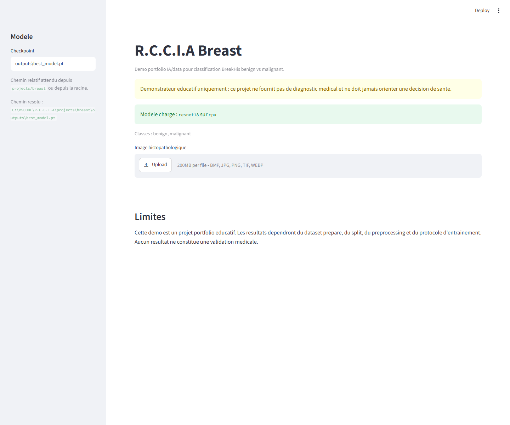
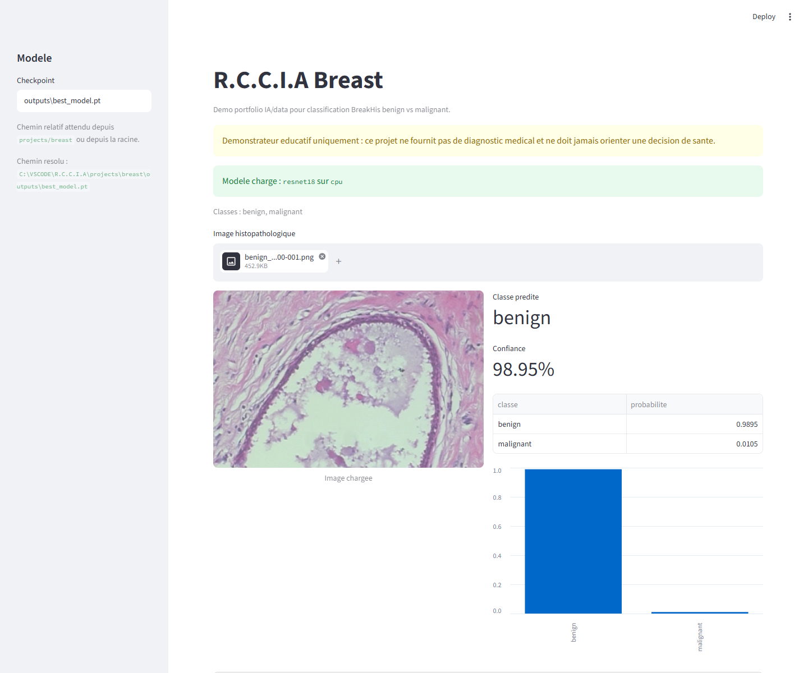
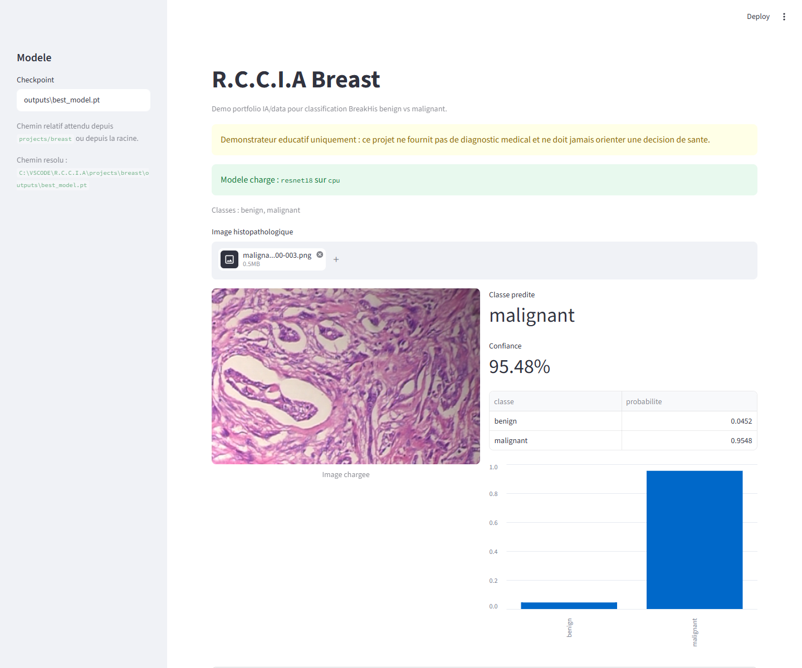

# R.C.C.I.A Breast

Projet portfolio IA/data de computer vision pour classifier des images histopathologiques du cancer du sein en deux classes : `benign` et `malignant`.

> Important : R.C.C.I.A Breast est un demonstrateur educatif. Il ne fournit pas de diagnostic medical, ne remplace pas un avis professionnel et ne doit jamais orienter une decision de sante.

Ce dossier est un sous-projet du monorepo R.C.C.I.A. Les commandes ci-dessous supposent d'etre place a la racine du repo.

## Statut

V2.1 error analysis :

- structure du sous-projet creee ;
- package Python `rccia_breast` ;
- pipeline PyTorch prepare ;
- scripts BreakHis et split patient-aware ;
- app Streamlit V1 ;
- tests smoke CPU rapides ;
- dataset BreakHis Kaggle prepare localement ;
- split patient-aware realise avec 81 patients detectes ;
- baseline ResNet18 pre-entrainee entrainee et evaluee.
- captures Streamlit integrees au README ;
- benchmark patient-aware ResNet18 / MobileNetV3 small / EfficientNet-B0 realise.
- analyse d'erreurs EfficientNet-B0 avec magnification, patient_id et Grad-CAM local.
- pack portfolio V2.2 ajoute pour CV, LinkedIn et entretien.

## Final Project Status

Breast Vision est verrouille comme projet portfolio jusqu'a la V2.2 :

- V1 : real patient-aware baseline sur BreakHis ;
- V1.1 : captures Streamlit integrees au README ;
- V2 : model comparison ResNet18 / MobileNetV3 small / EfficientNet-B0 ;
- V2.1 : error analysis + magnification/patient analysis ;
- V2.2 : portfolio publishing pack.

Docs portfolio :

- [Project summary](docs/PROJECT_SUMMARY.md)
- [Interview pitch](docs/INTERVIEW_PITCH.md)
- [LinkedIn draft](docs/LINKEDIN_DRAFT.md)
- [Release notes V2.1](docs/RELEASE_NOTES_V2_1.md)
- [V2 model comparison](docs/V2_MODEL_COMPARISON.md)
- [V2 error analysis](docs/V2_ERROR_ANALYSIS.md)
- [Patient-aware split](docs/PATIENT_AWARE_SPLIT.md)

Tag de reference prevu : `breast-v2.1-error-analysis`.

## Objectif V1

Preparer une baseline propre pour le dataset public BreakHis :

- classification binaire `benign` vs `malignant` ;
- preparation des images vers une structure `ImageFolder` ;
- extraction de grossissement `40X`, `100X`, `200X`, `400X` si possible ;
- extraction de `patient_id` si lisible dans les chemins ou noms de fichiers ;
- split classique ou patient-aware ;
- entrainement PyTorch / Torchvision ;
- evaluation accuracy, precision, recall, F1-score et matrice de confusion ;
- prediction CLI ;
- demo Streamlit avec Grad-CAM.

## Dataset

Dataset cible : **BreakHis / Breast Cancer Histopathological Database**.

Classes normalisees :

| Classe | Description |
| --- | --- |
| `benign` | images histopathologiques benignes |
| `malignant` | images histopathologiques malignes |

Point de vigilance : BreakHis contient plusieurs grossissements, typiquement `40X`, `100X`, `200X` et `400X`. Le projet conserve ces informations dans `metadata.csv` quand elles sont detectables.

## Resultats V1 Reels

Dataset utilise : Kaggle `ambarish/breakhis`, extrait dans `C:\VSCODE\datasets\breakhis`.

Structure detectee :

```text
C:\VSCODE\datasets\breakhis\
|-- Folds.csv
`-- BreaKHis_v1/
    `-- BreaKHis_v1/
        `-- histology_slides/
            `-- breast/
                |-- benign/
                `-- malignant/
```

Images preparees dans `projects/breast/data/raw` :

| Classe | Images |
| --- | ---: |
| `benign` | 2 480 |
| `malignant` | 5 429 |
| **Total** | **7 909** |

Metadata detectee :

| Champ | Resultat |
| --- | ---: |
| Patients detectes | 81 |
| `40X` | 1 995 |
| `100X` | 2 081 |
| `200X` | 2 013 |
| `400X` | 1 820 |

Split patient-aware :

| Split | Benign | Malignant | Total | Patients |
| --- | ---: | ---: | ---: | ---: |
| Train | 1 633 | 3 520 | 5 153 | 55 |
| Val | 339 | 936 | 1 275 | 11 |
| Test | 508 | 973 | 1 481 | 15 |

Verification leakage : aucun `patient_id` partage entre `train`, `val` et `test`.

Baseline :

- modele : ResNet18 pre-entraine ;
- epochs : 3 ;
- batch size : 16 ;
- image size : 224 ;
- split : patient-aware.

Historique validation :

| Epoch | Train accuracy | Val accuracy |
| --- | ---: | ---: |
| 1 | 0.8830 | 0.7451 |
| 2 | 0.9280 | 0.8275 |
| 3 | 0.9488 | 0.8533 |

Evaluation test :

| Classe | Precision | Recall | F1-score | Support |
| --- | ---: | ---: | ---: | ---: |
| `benign` | 0.8860 | 0.7953 | 0.8382 | 508 |
| `malignant` | 0.8985 | 0.9466 | 0.9219 | 973 |
| **Macro avg** | **0.8923** | **0.8709** | **0.8800** | **1 481** |

Accuracy test : **0.8947**.

Confusions test :

| Vrai label | Prediction | Count |
| --- | --- | ---: |
| `benign` | `malignant` | 104 |
| `malignant` | `benign` | 52 |

Analyse par grossissement :

| Grossissement | Images test | Correctes | Accuracy |
| --- | ---: | ---: | ---: |
| `40X` | 378 | 332 | 0.8783 |
| `100X` | 397 | 354 | 0.8917 |
| `200X` | 375 | 348 | 0.9280 |
| `400X` | 331 | 291 | 0.8792 |

Prediction CLI :

- image `benign` testee : commande OK, prediction `benign`, confiance 0.9895 ;
- image `malignant` testee : commande OK, prediction `benign`, confiance 0.9988, donc exemple d'erreur a analyser dans une prochaine phase.

Streamlit : test local HTTP 200 OK avec `projects/breast/app.py`.

Lecture portfolio : le score est obtenu avec un split patient-aware, donc plus strict qu'un split random image-level. Les resultats restent experimentaux sur dataset public BreakHis et ne constituent pas une validation clinique.

## V2 - Model Comparison + Patient-Aware Benchmark

Objectif : comparer plusieurs architectures sur le meme split patient-aware BreakHis, avec les memes hyperparametres.

Commande lancee depuis la racine du monorepo :

```powershell
.\.venv\Scripts\python.exe projects\breast\scripts\run_model_comparison.py --data-dir projects\breast\data\processed --models resnet18 mobilenet_v3_small efficientnet_b0 --epochs 3 --batch-size 16 --image-size 224 --output-dir projects\breast\outputs\model_comparison
```

Configuration :

- split patient-aware existant, patient overlap = 0 ;
- pretrained active ;
- epochs : 3 ;
- batch size : 16 ;
- image size : 224 ;
- test set : 1 481 images.

Resultats V2 :

| Modele | Accuracy | Macro F1 | Recall malignant | F1 benign | F1 malignant | Train time | Eval ms/image |
| --- | ---: | ---: | ---: | ---: | ---: | ---: | ---: |
| `resnet18` | 0.8947 | 0.8800 | 0.9466 | 0.8382 | 0.9219 | 510.19 s | 15.12 |
| `mobilenet_v3_small` | 0.8575 | 0.8206 | 0.9979 | 0.7392 | 0.9020 | 316.66 s | 8.94 |
| `efficientnet_b0` | 0.9122 | 0.9004 | 0.9568 | 0.8660 | 0.9347 | 762.23 s | 13.51 |

Accuracy par grossissement :

| Modele | 40X | 100X | 200X | 400X |
| --- | ---: | ---: | ---: | ---: |
| `resnet18` | 0.8783 | 0.8917 | 0.9280 | 0.8792 |
| `mobilenet_v3_small` | 0.7778 | 0.8564 | 0.8987 | 0.9033 |
| `efficientnet_b0` | 0.8757 | 0.9194 | 0.9467 | 0.9063 |

Lecture rapide :

- `efficientnet_b0` obtient la meilleure accuracy, la meilleure macro F1 et les meilleurs F1 par classe.
- `mobilenet_v3_small` est le plus rapide et obtient le meilleur recall `malignant`, mais il sacrifie beaucoup le recall/F1 `benign`.
- `resnet18` reste une baseline stable, avec des resultats identiques a la V1.
- Le grossissement `200X` reste le plus favorable dans ce benchmark.
- Ces resultats sont experimentaux sur BreakHis public, avec split patient-aware local, et ne constituent pas une validation clinique.

## V2.1 - Error Analysis + Magnification/Patient Analysis

Objectif : analyser les erreurs du meilleur modele global V2, `efficientnet_b0`, sur le
split patient-aware BreakHis.

Commande lancee depuis la racine du monorepo :

```powershell
.\.venv\Scripts\python.exe projects\breast\scripts\analyze_errors.py --data-dir projects\breast\data\processed --checkpoint projects\breast\outputs\model_comparison\efficientnet_b0\best_model.pt --model efficientnet_b0 --output-dir projects\breast\outputs\error_analysis --metadata projects\breast\data\raw\metadata.csv --max-examples 15
```

Resultats V2.1 :

| Metrique | Valeur |
| --- | ---: |
| Images test | 1 481 |
| Predictions correctes | 1 351 |
| Erreurs | 130 |
| Accuracy | 0.9122 |
| False positives `benign -> malignant` | 88 |
| False negatives `malignant -> benign` | 42 |
| Confiance moyenne correctes | 0.9700 |
| Confiance moyenne erreurs | 0.8464 |

Erreurs par grossissement :

| Grossissement | Images test | Erreurs | Accuracy |
| --- | ---: | ---: | ---: |
| `40X` | 378 | 47 | 0.8757 |
| `100X` | 397 | 32 | 0.9194 |
| `200X` | 375 | 20 | 0.9467 |
| `400X` | 331 | 31 | 0.9063 |

Top patients avec erreurs :

| Patient | Images | Erreurs | Accuracy | FP | FN |
| --- | ---: | ---: | ---: | ---: | ---: |
| `14-16184CD` | 124 | 76 | 0.3871 | 76 | 0 |
| `14-10926` | 39 | 17 | 0.5641 | 0 | 17 |
| `14-18842D` | 64 | 13 | 0.7969 | 0 | 13 |
| `14-22549AB` | 121 | 11 | 0.9091 | 11 | 0 |
| `14-19440` | 142 | 5 | 0.9648 | 0 | 5 |

Lecture rapide :

- l'erreur dominante est `benign -> malignant` ;
- le grossissement `40X` est le plus difficile dans cette analyse ;
- certains patients concentrent une part importante des erreurs ;
- les predictions correctes sont en moyenne plus confiantes que les erreurs ;
- 60 exemples locaux ont ete exportes avec Grad-CAM, sans erreur Grad-CAM.

Les outputs V2.1 restent locaux dans `projects/breast/outputs/error_analysis/` et ne
sont pas committes. Voir [docs/V2_ERROR_ANALYSIS.md](docs/V2_ERROR_ANALYSIS.md).

## Stack Technique

- Python
- PyTorch / Torchvision
- OpenCV
- Pandas / NumPy
- Scikit-learn
- Matplotlib
- Streamlit
- Grad-CAM
- Pytest

## Structure

```text
projects/breast/
|-- README.md
|-- app.py
|-- rccia_breast/
|-- scripts/
|-- tests/
|-- docs/
|-- data/
|   |-- raw/
|   `-- processed/
`-- outputs/
```

Les dossiers `data/` et `outputs/` restent locaux et ne doivent pas etre committes, sauf les fichiers `.gitkeep`.

## Preparation Dataset

Commande indicative :

```powershell
.\.venv\Scripts\python.exe projects\breast\scripts\prepare_breakhis_dataset.py --input C:\VSCODE\datasets\breakhis --output projects\breast\data\raw
```

Le script copie les images vers :

```text
projects/breast/data/raw/
|-- benign/
|-- malignant/
`-- metadata.csv
```

Il affiche :

- nombre d'images `benign` ;
- nombre d'images `malignant` ;
- grossissements detectes ;
- nombre de patients detectes si possible ;
- avertissement si `patient_id` n'est pas detecte.

## Split

Split classique :

```powershell
.\.venv\Scripts\python.exe projects\breast\scripts\split_image_folder.py --input projects\breast\data\raw --output projects\breast\data\processed --val-ratio 0.15 --test-ratio 0.15
```

Split patient-aware si `metadata.csv` contient `patient_id` :

```powershell
.\.venv\Scripts\python.exe projects\breast\scripts\split_image_folder.py --input projects\breast\data\raw --output projects\breast\data\processed --metadata projects\breast\data\raw\metadata.csv --patient-aware --val-ratio 0.15 --test-ratio 0.15
```

Si le split patient-aware est demande mais impossible, le script echoue avec un message clair.

## Entrainement

```powershell
.\.venv\Scripts\python.exe -m projects.breast.rccia_breast.train --data-dir projects\breast\data\processed --model resnet18 --epochs 3 --batch-size 16 --image-size 224 --output-dir projects\breast\outputs
```

Modeles supportes :

- `resnet18` par defaut ;
- `mobilenet_v3_small` ;
- `efficientnet_b0`.

## Comparaison De Modeles

```powershell
.\.venv\Scripts\python.exe projects\breast\scripts\run_model_comparison.py --data-dir projects\breast\data\processed --models resnet18 mobilenet_v3_small efficientnet_b0 --epochs 3 --batch-size 16 --image-size 224 --output-dir projects\breast\outputs\model_comparison
```

Le script genere localement `summary.csv`, `summary.json`, les rapports de classification, matrices de confusion, courbes train/val et checkpoints par modele dans `projects/breast/outputs/model_comparison/`.

## Evaluation

```powershell
.\.venv\Scripts\python.exe -m projects.breast.rccia_breast.evaluate --data-dir projects\breast\data\processed --checkpoint projects\breast\outputs\best_model.pt --model resnet18 --output-dir projects\breast\outputs\eval
```

## Prediction CLI

```powershell
.\.venv\Scripts\python.exe -m projects.breast.rccia_breast.predict --checkpoint projects\breast\outputs\best_model.pt --image projects\breast\data\processed\test\benign\example.png --pretty
```

## Streamlit

```powershell
.\.venv\Scripts\streamlit.exe run projects\breast\app.py
```

L'application ne plante pas si le checkpoint est absent : elle affiche les commandes a lancer pour entrainer un modele local.

## Apercu de l'application Streamlit

Accueil avec le modele local charge, les classes disponibles et le disclaimer medical :



Prediction `benign` sur une image du test set BreakHis :



Prediction `malignant` sur une image du test set BreakHis :



## Patient-Aware Split

Le point fort attendu de Breast est de limiter le risque de fuite de donnees entre train, validation et test. Si plusieurs images du meme patient apparaissent dans plusieurs splits, les scores peuvent etre trop optimistes.

Le script de preparation tente donc d'extraire un `patient_id` depuis les noms de fichiers BreakHis ou depuis des patterns de type `patient`, `case` ou `pt` dans les chemins. Voir [docs/PATIENT_AWARE_SPLIT.md](docs/PATIENT_AWARE_SPLIT.md).

## Docs

- [Dataset guide](docs/DATASET_GUIDE.md)
- [Patient-aware split](docs/PATIENT_AWARE_SPLIT.md)
- [V2 model comparison](docs/V2_MODEL_COMPARISON.md)
- [V2 error analysis](docs/V2_ERROR_ANALYSIS.md)
- [Project summary](docs/PROJECT_SUMMARY.md)
- [Interview pitch](docs/INTERVIEW_PITCH.md)
- [LinkedIn draft](docs/LINKEDIN_DRAFT.md)
- [Release notes V2.1](docs/RELEASE_NOTES_V2_1.md)

## Tests

Depuis la racine du repo :

```powershell
.\.venv\Scripts\python.exe -m pytest -q
```

## Limites

- Demonstrateur educatif, pas outil medical.
- Dataset public, sans validation clinique independante.
- Les resultats V1 viennent d'un split patient-aware local, pas d'une cohorte clinique externe.
- Les scores dependent du split, du niveau de grossissement, du preprocessing et du protocole d'entrainement.
- Le split patient-aware depend de la disponibilite et de la qualite des identifiants patients.
- Grad-CAM est une visualisation exploratoire, pas une preuve medicale.
