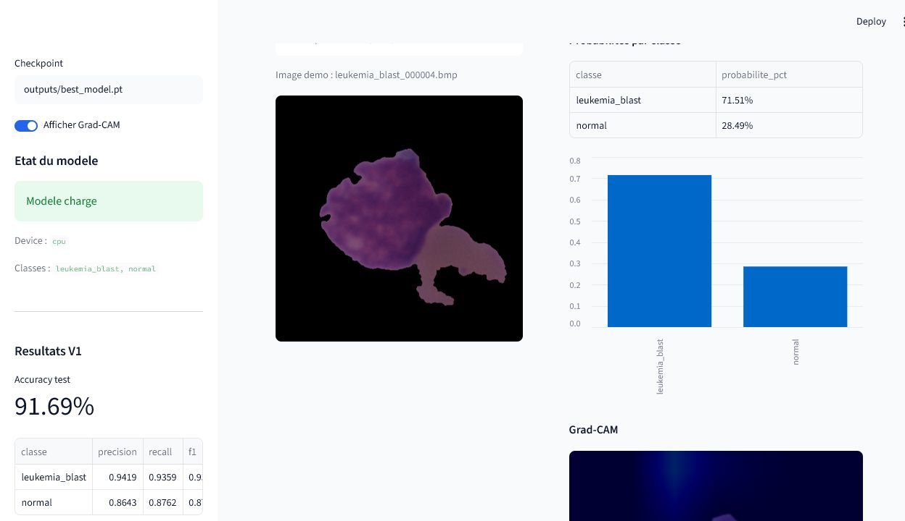
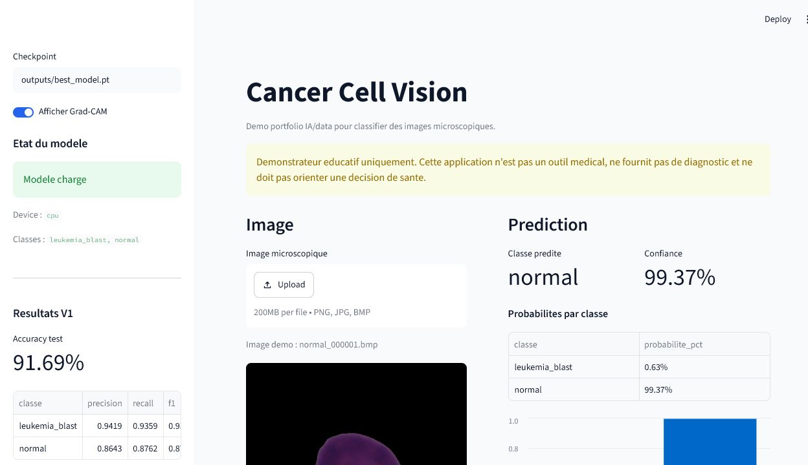

# Cancer Cell Vision

Projet portfolio IA/data de computer vision pour classifier des images microscopiques de cellules sanguines en deux classes : `normal` et `leukemia_blast`.

> Important : Cancer Cell Vision est un demonstrateur educatif. Il ne fournit pas de diagnostic medical, ne remplace pas un avis professionnel et ne doit jamais orienter une decision de sante.

Ce dossier est le sous-projet leucemie du monorepo R.C.C.I.A. Les commandes ci-dessous supposent d'etre place dans `projects/leukemia` et d'utiliser le venv cree a la racine du repo.

## Resume

Cette V1 met en place une pipeline complete de classification d'images :

- preparation d'un dataset public Kaggle ;
- split `train` / `val` / `test` ;
- entrainement par transfer learning avec ResNet18 ;
- evaluation avec accuracy, precision, recall, F1-score et matrice de confusion ;
- prediction en ligne de commande ;
- interface Streamlit avec upload d'image, probabilites et Grad-CAM.

La demo locale a ete testee avec le checkpoint reel `outputs/best_model.pt`.

## Project Status

Version finale actuelle : `v2.2-error-analysis`.

| Version | Statut | Contenu |
| --- | --- | --- |
| V1 | termine | pipeline reel, Streamlit, Grad-CAM, resultats test |
| V2 | termine | comparaison de modeles et rapports d'evaluation |
| V2.1 | termine | benchmark reel ResNet18 / MobileNetV3 / EfficientNet |
| V2.2 | termine | analyse des erreurs, false positives / false negatives |
| V2.3 | termine | pack de publication portfolio |

Documents utiles :

- [Project summary](docs/PROJECT_SUMMARY.md)
- [Interview pitch](docs/INTERVIEW_PITCH.md)
- [LinkedIn draft](docs/LINKEDIN_DRAFT.md)
- [Model comparison V2](docs/V2_MODEL_COMPARISON.md)
- [Release notes v2.2](docs/RELEASE_NOTES_V2_2.md)

## Stack Technique

- Python
- PyTorch / Torchvision
- OpenCV
- Pandas / NumPy
- Scikit-learn
- Matplotlib
- Streamlit
- Grad-CAM
- Pytest

## Dataset V1

Dataset public utilise : **Kaggle - andrewmvd/leukemia-classification**.

Lien manuel : https://www.kaggle.com/datasets/andrewmvd/leukemia-classification

Images preparees :

| Classe | Images |
| --- | ---: |
| `normal` | 3389 |
| `leukemia_blast` | 7272 |

Split utilise :

| Classe | Train | Val | Test |
| --- | ---: | ---: | ---: |
| `normal` | 2372 | 508 | 509 |
| `leukemia_blast` | 5090 | 1090 | 1092 |

Les donnees locales restent ignorees par Git : `data/raw/`, `data/processed/`, `outputs/` et les checkpoints ne sont pas versionnes.

## Pipeline ML

```text
Dataset Kaggle
  -> preparation data/raw/normal + data/raw/leukemia_blast
  -> split data/processed/train|val|test
  -> entrainement ResNet18 transfer learning
  -> evaluation test set
  -> prediction CLI
  -> demo Streamlit + Grad-CAM
```

Baseline V1 :

- modele : ResNet18 en transfer learning ;
- entrainement : CPU, 5 epochs, batch size 16 ;
- checkpoint local : `outputs/best_model.pt` ;
- meilleure validation accuracy : `0.9168` ;
- test accuracy : `0.9169`.

## Resultats Experimentaux V1

Rapport de classification sur le test set :

| Classe | Precision | Recall | F1-score | Support |
| --- | ---: | ---: | ---: | ---: |
| `leukemia_blast` | 0.9419 | 0.9359 | 0.9389 | 1092 |
| `normal` | 0.8643 | 0.8762 | 0.8702 | 509 |
| `macro avg` | 0.9031 | 0.9061 | 0.9046 | 1601 |
| `weighted avg` | 0.9173 | 0.9169 | 0.9171 | 1601 |

Matrice de confusion test :

| Vraie classe / prediction | `leukemia_blast` | `normal` |
| --- | ---: | ---: |
| `leukemia_blast` | 1022 | 70 |
| `normal` | 63 | 446 |

Exemples de test Streamlit :

- `leukemia_blast_000004.bmp` -> prediction `leukemia_blast`, confiance `71.51%` ;
- `normal_000001.bmp` -> prediction `normal`, confiance `99.37%`.

Ces scores sont uniquement des resultats experimentaux de projet portfolio. Ils ne constituent pas une validation clinique.

## Demo Locale

Lancer l'application :

```powershell
..\..\.venv\Scripts\streamlit.exe run app.py
```

Dans l'interface :

- verifier que le modele `outputs/best_model.pt` est charge ;
- uploader une image depuis `data\processed\test\leukemia_blast` ou `data\processed\test\normal` ;
- lire la classe predite, la confiance et les probabilites ;
- afficher la visualisation Grad-CAM si disponible ;
- garder visible le disclaimer medical.

Captures recommandees pour le portfolio :

- page Streamlit avec modele charge ;
- prediction `leukemia_blast` avec Grad-CAM ;
- prediction `normal` avec probabilites.

La checklist detaillee est dans [docs/assets/README.md](docs/assets/README.md).

## Apercu De L'Application Streamlit

Page d'accueil avec checkpoint charge, disclaimer medical et resultats V1 :


Prediction `leukemia_blast` avec probabilites et visualisation Grad-CAM :



Prediction `normal` avec probabilites par classe :



## Architecture Du Projet

```text
.
|-- app.py
|-- rccia_leukemia/
|   |-- data.py
|   |-- error_analysis.py
|   |-- evaluate.py
|   |-- gradcam.py
|   |-- model.py
|   |-- predict.py
|   |-- train.py
|   `-- utils.py
|-- scripts/
|   |-- analyze_errors.py
|   |-- prepare_leukemia_dataset.py
|   |-- run_model_comparison.py
|   |-- setup_windows.bat
|   `-- split_image_folder.py
|-- docs/
|   |-- assets/
|   |   `-- README.md
|   |-- DATASET_GUIDE.md
|   |-- INTERVIEW_PITCH.md
|   |-- LINKEDIN_DRAFT.md
|   |-- PROJECT_SUMMARY.md
|   |-- REAL_DATASET_V1.md
|   |-- RELEASE_NOTES_V2_2.md
|   |-- SETUP_WINDOWS.md
|   `-- V2_MODEL_COMPARISON.md
`-- tests/
```

## Installation

Depuis la racine du repo :

```powershell
python -m venv .venv
.\.venv\Scripts\Activate.ps1
python -m pip install --upgrade pip
python -m pip install -r requirements.txt
python -m pip install -r requirements-dev.txt
cd projects\leukemia
```

Tu peux aussi consulter [docs/SETUP_WINDOWS.md](docs/SETUP_WINDOWS.md).

## Reproduire L'Experience

Configurer l'acces Kaggle localement hors du depot, puis telecharger le dataset :

```powershell
..\..\.venv\Scripts\python.exe -m pip install kaggle
New-Item -ItemType Directory -Force C:\VSCODE\datasets\leukemia-classification
..\..\.venv\Scripts\kaggle.exe datasets download -d andrewmvd/leukemia-classification -p C:\VSCODE\datasets\leukemia-classification --unzip
```

Preparer les dossiers `data/raw/normal` et `data/raw/leukemia_blast` :

```powershell
..\..\.venv\Scripts\python.exe scripts\prepare_leukemia_dataset.py --source C:\VSCODE\datasets\leukemia-classification\C-NMC_Leukemia\training_data --output data\raw --overwrite
```

Creer les splits :

```powershell
..\..\.venv\Scripts\python.exe scripts\split_image_folder.py --input data\raw --output data\processed --val-ratio 0.15 --test-ratio 0.15 --overwrite
```

Entrainer :

```powershell
..\..\.venv\Scripts\python.exe -m rccia_leukemia.train --data-dir data\processed --epochs 5 --batch-size 16 --output-dir outputs
```

Evaluer :

```powershell
..\..\.venv\Scripts\python.exe -m rccia_leukemia.evaluate --data-dir data\processed --checkpoint outputs\best_model.pt --output-dir outputs\eval
```

Predire une image :

```powershell
..\..\.venv\Scripts\python.exe -m rccia_leukemia.predict --checkpoint outputs\best_model.pt --image data\processed\test\leukemia_blast\leukemia_blast_000004.bmp --pretty
```

Lancer Streamlit :

```powershell
..\..\.venv\Scripts\streamlit.exe run app.py
```

## V2 - Comparaison De Modeles

La V2 ajoute un workflow de comparaison pour entrainer et evaluer plusieurs architectures sur les memes splits :

- `resnet18`
- `efficientnet_b0`
- `mobilenet_v3_small`

Commande complete :

```powershell
..\..\.venv\Scripts\python.exe scripts\run_model_comparison.py --data-dir data\processed --epochs 5 --batch-size 16 --output-dir outputs\model_comparison
```

Le workflow genere :

- `outputs/model_comparison/summary.csv`
- `outputs/model_comparison/summary.json`
- un sous-dossier par modele avec checkpoint, courbes train/val, matrice de confusion et classification report.

Les outputs restent ignores par Git et ne sont pas versionnes.

Un smoke run local a valide le workflow sur deux modeles (`resnet18`, `mobilenet_v3_small`) avec 1 epoch, image size 64 et `--no-pretrained`. Ces scores servent uniquement a verifier l'orchestration V2 ; ils ne remplacent pas une comparaison complete avec poids pre-entraines.

| Modele | Accuracy smoke | F1 normal | F1 leukemia_blast |
| --- | ---: | ---: | ---: |
| `resnet18` | 0.8164 | 0.6811 | 0.8711 |
| `mobilenet_v3_small` | 0.6821 | 0.0000 | 0.8110 |

## V2.1 - Benchmark Reel

La V2.1 lance une comparaison plus credible avec poids ImageNet pre-entraines, meme split `data/processed`, 3 epochs, batch size 16 et images 224x224.

Commandes lancees :

```powershell
..\..\.venv\Scripts\python.exe scripts\run_model_comparison.py --data-dir data\processed --models resnet18 mobilenet_v3_small --epochs 3 --batch-size 16 --image-size 224 --output-dir outputs\model_comparison_real
..\..\.venv\Scripts\python.exe scripts\run_model_comparison.py --data-dir data\processed --models efficientnet_b0 --epochs 3 --batch-size 16 --image-size 224 --output-dir outputs\model_comparison_real_efficientnet
```

Resultats test obtenus :

| Modele | Accuracy | F1 normal | F1 leukemia_blast | Recall normal | Recall leukemia_blast | Train time |
| --- | ---: | ---: | ---: | ---: | ---: | ---: |
| `resnet18` | 0.8988 | 0.8251 | 0.9288 | 0.7505 | 0.9679 | 586.95 s |
| `mobilenet_v3_small` | 0.8976 | 0.8295 | 0.9268 | 0.7839 | 0.9505 | 277.76 s |
| `efficientnet_b0` | 0.8863 | 0.8080 | 0.9193 | 0.7525 | 0.9487 | 890.49 s |

Lecture rapide :

- `resnet18` obtient la meilleure accuracy et le meilleur recall `leukemia_blast` sur ce protocole court.
- `mobilenet_v3_small` est presque au meme niveau, avec le meilleur F1 `normal` et un temps d'entrainement beaucoup plus court.
- `efficientnet_b0` est le plus lent dans ce run CPU et ne depasse pas les deux autres modeles.

Ces resultats V2.1 sont comparables entre eux car ils partagent le meme protocole. Ils ne remplacent pas la baseline V1, qui avait ete entrainee 5 epochs, et ne constituent pas une validation medicale.

Fichiers generes localement, non versionnes :

- `outputs/model_comparison_real/summary.csv`
- `outputs/model_comparison_real/summary.json`
- `outputs/model_comparison_real_efficientnet/summary.csv`
- `outputs/model_comparison_real_efficientnet/summary.json`
- rapports JSON/CSV, matrices de confusion PNG et courbes train/val dans chaque sous-dossier modele.

Documentation detaillee : [docs/V2_MODEL_COMPARISON.md](docs/V2_MODEL_COMPARISON.md).

## V2.2 - Error Analysis + Interpretability

La V2.2 ajoute un workflow d'analyse qualitative pour comprendre les bonnes predictions et les erreurs du modele, au-dela de l'accuracy globale.

Commande lancee avec le checkpoint V1 ResNet18 utilise par Streamlit :

```powershell
..\..\.venv\Scripts\python.exe scripts\analyze_errors.py --data-dir data\processed --checkpoint outputs\best_model.pt --model resnet18 --output-dir outputs\error_analysis --max-examples 12
```

Definitions utilisees :

- `false_positive` : image `normal` predite `leukemia_blast`.
- `false_negative` : image `leukemia_blast` predite `normal`.
- `correct` : prediction identique au vrai label.

Resultats obtenus sur le test set V1 :

| Indicateur | Valeur |
| --- | ---: |
| Images analysees | 1601 |
| Predictions correctes | 1468 |
| Erreurs | 133 |
| False positives | 63 |
| False negatives | 70 |
| Accuracy | 0.9169 |
| Confiance moyenne bonnes predictions | 0.9110 |
| Confiance moyenne erreurs | 0.7057 |

Fichiers generes localement, non versionnes :

- `outputs/error_analysis/predictions.csv`
- `outputs/error_analysis/summary.json`
- `outputs/error_analysis/examples/`
- exemples annotes pour `false_positive`, `false_negative`, `correct_high_confidence`, `correct_low_confidence`
- Grad-CAM exporte pour quelques false positives et false negatives

La demo Streamlit affiche maintenant une section `Analyse des erreurs V2.2` si `outputs/error_analysis/summary.json` existe. Si l'analyse n'a pas encore ete generee, l'application affiche un message propre et continue de fonctionner.

Ces exports restent des artefacts locaux pour le portfolio. Ils ne sont pas committes et ne constituent pas une validation medicale.

## Limites

- Demonstrateur educatif, pas outil medical.
- Dataset public Kaggle, sans validation clinique independante.
- Classes desequilibrees : plus d'images `leukemia_blast` que `normal`.
- Baseline courte entrainee 5 epochs sur CPU.
- Scores dependants du split local, du preprocessing et du protocole d'entrainement.
- Grad-CAM utile pour expliquer visuellement une prediction, mais pas une preuve medicale.
- Aucune validation multi-centrique ou par specialistes n'est realisee dans ce projet.

## Prochaines Ameliorations

- Ameliorer la presentation Grad-CAM dans Streamlit.
- Ajouter de l'augmentation de donnees controlee.
- Relancer un benchmark plus long avec 5 a 10 epochs et augmentation de donnees.
- Ajouter une analyse des seuils de decision et de la calibration des probabilites.
- Tester une ponderation des classes ou un sampler dedie.
- Exporter une petite fiche portfolio avec contexte, resultats et limites.
- Creer une release `v1.0-baseline` ou `v2.0-comparison` selon le prochain jalon retenu.
