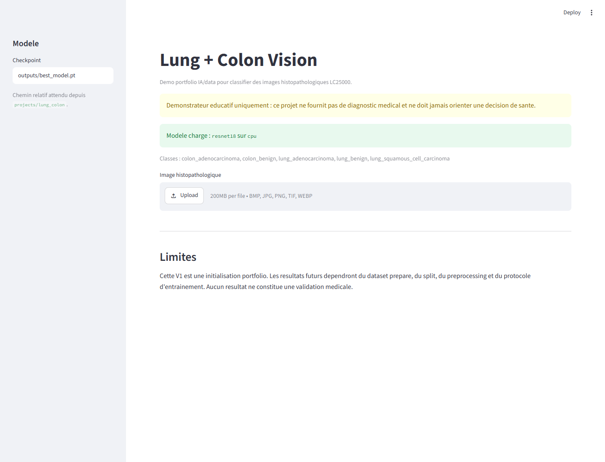
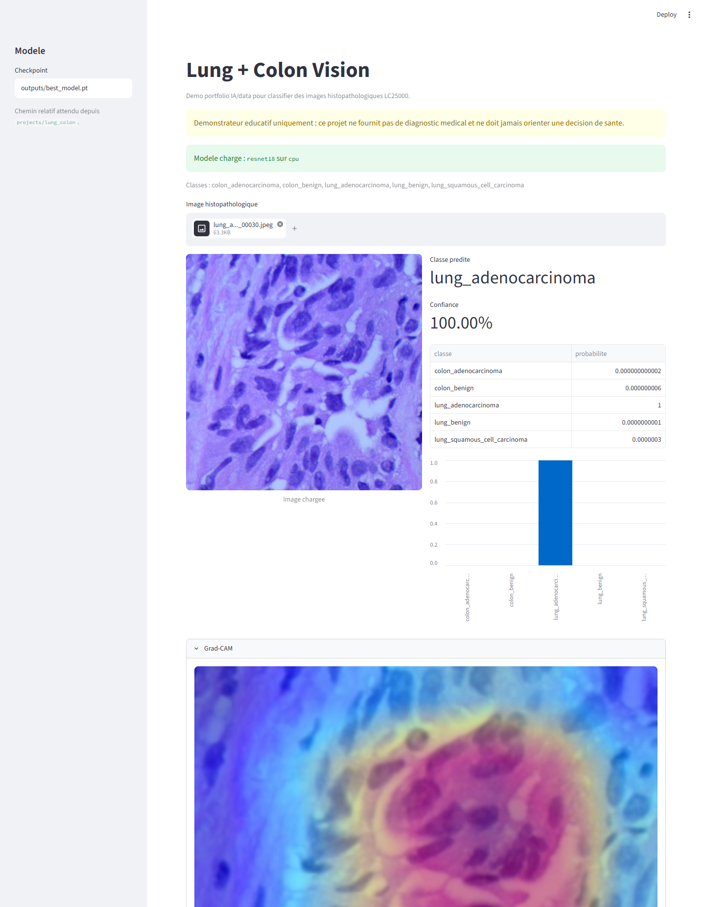
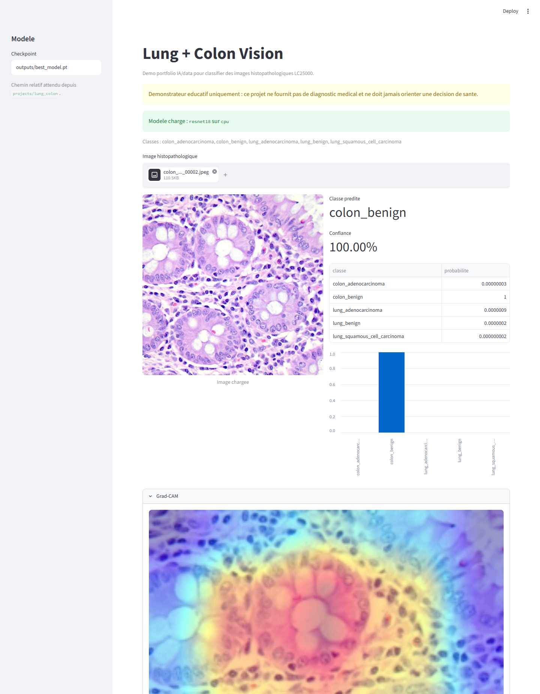

# Lung + Colon Vision

Projet portfolio IA/data de computer vision pour classifier des images histopathologiques lung/colon en cinq classes.

> Important : Lung + Colon Vision est un demonstrateur educatif. Il ne fournit pas de diagnostic medical, ne remplace pas un avis professionnel et ne doit jamais orienter une decision de sante.

Ce dossier est un sous-projet du monorepo R.C.C.I.A. Les commandes ci-dessous supposent d'etre place dans `projects/lung_colon` et d'utiliser le venv cree a la racine du repo.

## Objectif V1

Initialiser une baseline multi-classe propre sur le dataset public LC25000 :

- preparation d'un dataset public Kaggle ;
- normalisation des noms de classes ;
- split `train` / `val` / `test` ;
- entrainement PyTorch / Torchvision ;
- evaluation accuracy, precision, recall, F1-score et matrice de confusion ;
- prediction CLI ;
- demo Streamlit avec Grad-CAM.

## Classes

| Classe normalisee | Classe LC25000 habituelle |
| --- | --- |
| `colon_adenocarcinoma` | `colon_aca` |
| `colon_benign` | `colon_n` |
| `lung_adenocarcinoma` | `lung_aca` |
| `lung_benign` | `lung_n` |
| `lung_squamous_cell_carcinoma` | `lung_scc` |

## Stack Technique

- Python
- PyTorch / Torchvision
- OpenCV
- Pandas / NumPy
- Scikit-learn
- Matplotlib
- Streamlit
- Grad-CAM
- Pytest

## Structure

```text
projects/lung_colon/
|-- app.py
|-- rccia_lung_colon/
|-- scripts/
|-- tests/
|-- docs/
|-- data/
|   |-- raw/
|   `-- processed/
`-- outputs/
```

Les dossiers `data/` et `outputs/` restent locaux et ne doivent pas etre committes, sauf les fichiers `.gitkeep`.

## Installation

Depuis la racine du repo :

```powershell
python -m venv .venv
.\.venv\Scripts\Activate.ps1
python -m pip install --upgrade pip
python -m pip install -r requirements.txt
python -m pip install -r requirements-dev.txt
cd projects\lung_colon
```

## Dataset

Dataset cible : **LC25000 / Lung and Colon Cancer Histopathological Images**.

Commande Kaggle indicative :

```powershell
..\..\.venv\Scripts\kaggle.exe datasets download -d andrewmvd/lung-and-colon-cancer-histopathological-images -p C:\VSCODE\datasets\lc25000 --unzip
```

Preparer `data/raw` :

```powershell
..\..\.venv\Scripts\python.exe scripts\prepare_lc25000_dataset.py --source C:\VSCODE\datasets\lc25000 --output data\raw --overwrite
```

Creer les splits :

```powershell
..\..\.venv\Scripts\python.exe scripts\split_image_folder.py --input data\raw --output data\processed --val-ratio 0.15 --test-ratio 0.15 --overwrite
```

## Pipeline V1

Entrainer une baseline ResNet18 :

```powershell
..\..\.venv\Scripts\python.exe -m rccia_lung_colon.train --data-dir data\processed --model resnet18 --epochs 3 --batch-size 16 --image-size 224 --output-dir outputs
```

Evaluer :

```powershell
..\..\.venv\Scripts\python.exe -m rccia_lung_colon.evaluate --data-dir data\processed --checkpoint outputs\best_model.pt --output-dir outputs\eval
```

Predire une image :

```powershell
..\..\.venv\Scripts\python.exe -m rccia_lung_colon.predict --checkpoint outputs\best_model.pt --image data\processed\test\lung_adenocarcinoma\example.jpeg --pretty
```

Lancer Streamlit :

```powershell
..\..\.venv\Scripts\streamlit.exe run app.py
```

## Apercu De L'application Streamlit

Page d'accueil avec le checkpoint local charge, les classes LC25000 et le disclaimer medical visible :



Prediction sur une image `lung_adenocarcinoma`, avec probabilites par classe et Grad-CAM :



Prediction sur une image `colon_benign`, avec les probabilites par classe :



## Resultats V1 Reels

Run local realise sur CPU avec ResNet18 pre-entraine, `epochs=3`, `batch_size=16`, `image_size=224`, `learning_rate=0.0001` et `seed=42`.

Dataset prepare depuis **LC25000 / Lung and Colon Cancer Histopathological Images** :

| Classe | Images raw | Train | Val | Test |
| --- | ---: | ---: | ---: | ---: |
| `colon_adenocarcinoma` | 5 000 | 3 500 | 750 | 750 |
| `colon_benign` | 5 000 | 3 500 | 750 | 750 |
| `lung_adenocarcinoma` | 5 000 | 3 500 | 750 | 750 |
| `lung_benign` | 5 000 | 3 500 | 750 | 750 |
| `lung_squamous_cell_carcinoma` | 5 000 | 3 500 | 750 | 750 |
| **Total** | **25 000** | **17 500** | **3 750** | **3 750** |

Courbe d'entrainement :

| Epoch | Train loss | Train accuracy | Val loss | Val accuracy |
| ---: | ---: | ---: | ---: | ---: |
| 1 | 0.1112 | 0.9602 | 0.0219 | 0.9917 |
| 2 | 0.0446 | 0.9848 | 0.0130 | 0.9955 |
| 3 | 0.0274 | 0.9911 | 0.0082 | 0.9976 |

Evaluation test sur 3 750 images :

| Classe | Precision | Recall | F1-score | Support |
| --- | ---: | ---: | ---: | ---: |
| `colon_adenocarcinoma` | 1.0000 | 0.9973 | 0.9987 | 750 |
| `colon_benign` | 0.9987 | 1.0000 | 0.9993 | 750 |
| `lung_adenocarcinoma` | 0.9894 | 0.9947 | 0.9920 | 750 |
| `lung_benign` | 0.9987 | 1.0000 | 0.9993 | 750 |
| `lung_squamous_cell_carcinoma` | 0.9960 | 0.9907 | 0.9933 | 750 |
| **Macro avg** | **0.9965** | **0.9965** | **0.9965** | **3 750** |

Accuracy test : **0.9965**.

Artefacts generes localement dans `outputs/` :

- `best_model.pt` ;
- `train/training_history.json` et `train/training_history.csv` ;
- `train/training_loss.png` et `train/training_accuracy.png` ;
- `eval/test_classification_report.json` et `eval/test_classification_report.csv` ;
- `eval/test_confusion_matrix.png`.

Ces fichiers ne sont pas committes : ils restent des artefacts locaux reproductibles.

## Modeles Supportes

- `resnet18` par defaut ;
- `mobilenet_v3_small` ;
- `efficientnet_b0`.

## Tests

Depuis la racine du repo :

```powershell
.\.venv\Scripts\python.exe -m pytest -q
```

## Limites

- Demonstrateur educatif, pas outil medical.
- Dataset public, sans validation clinique independante.
- Les scores sont obtenus sur LC25000 avec un split local reproductible, pas sur une cohorte clinique externe.
- Les performances tres elevees doivent etre interpretees comme un resultat experimental portfolio, pas comme une preuve de robustesse medicale.
- Scores futurs dependront du split, du preprocessing, du modele et du protocole d'entrainement.
- Grad-CAM est une visualisation exploratoire, pas une preuve medicale.
