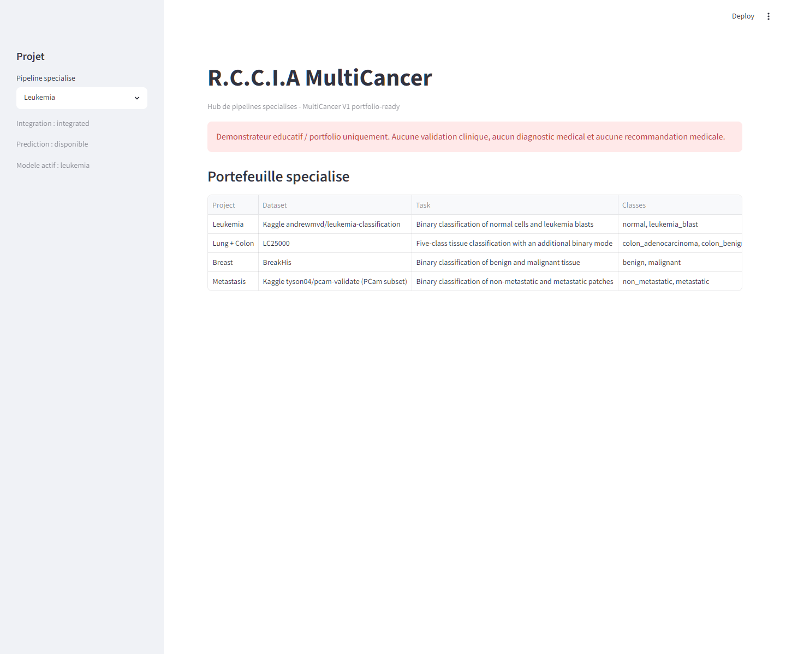
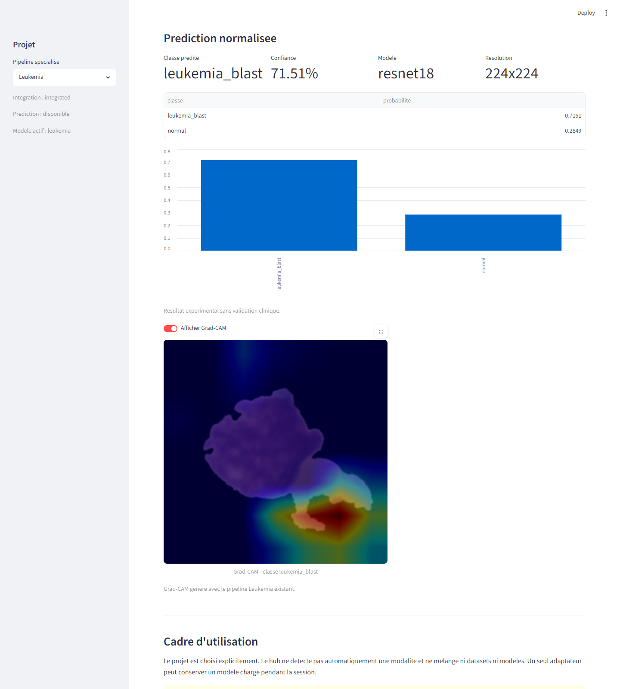
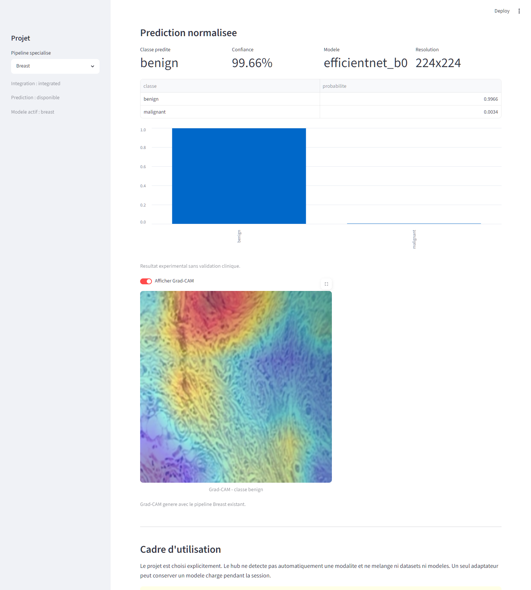
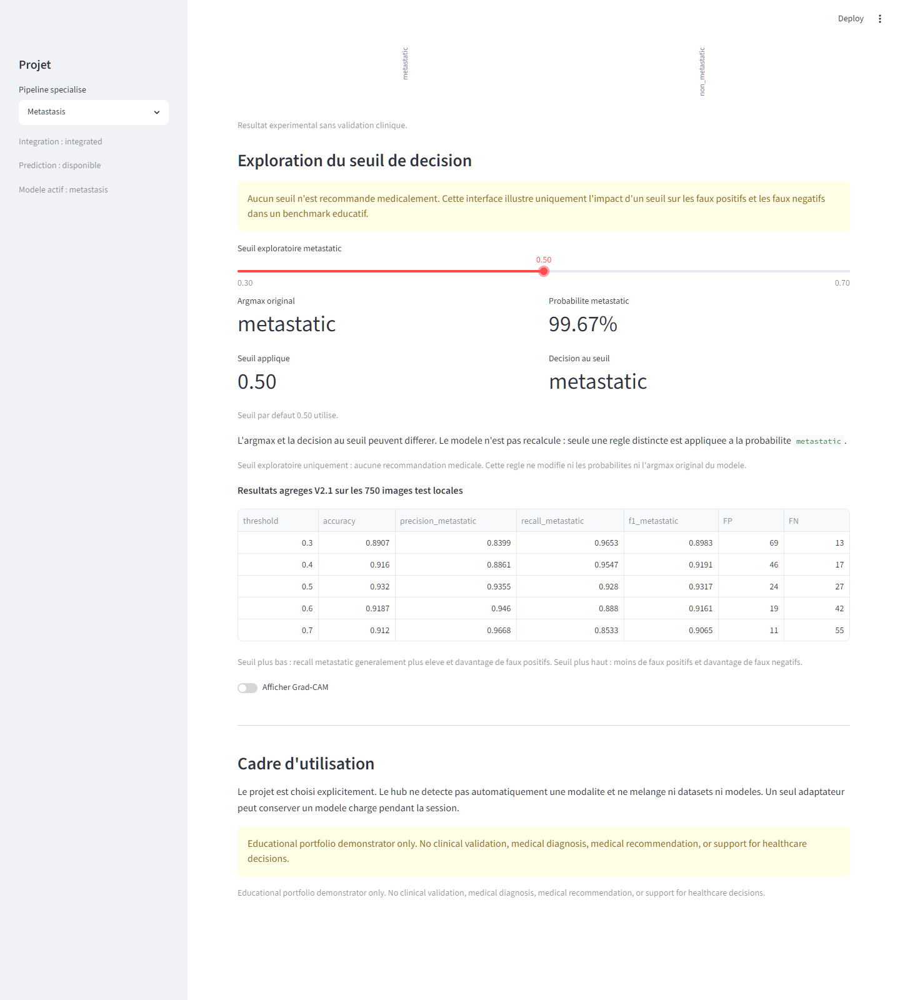
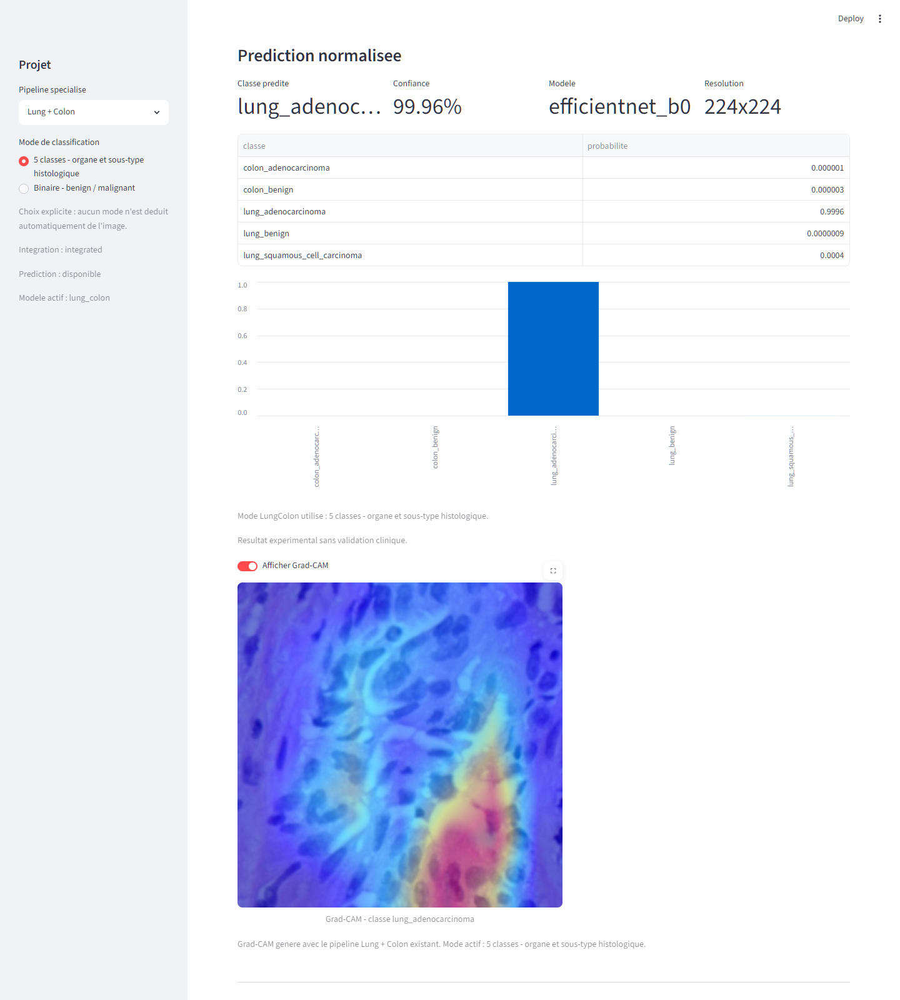
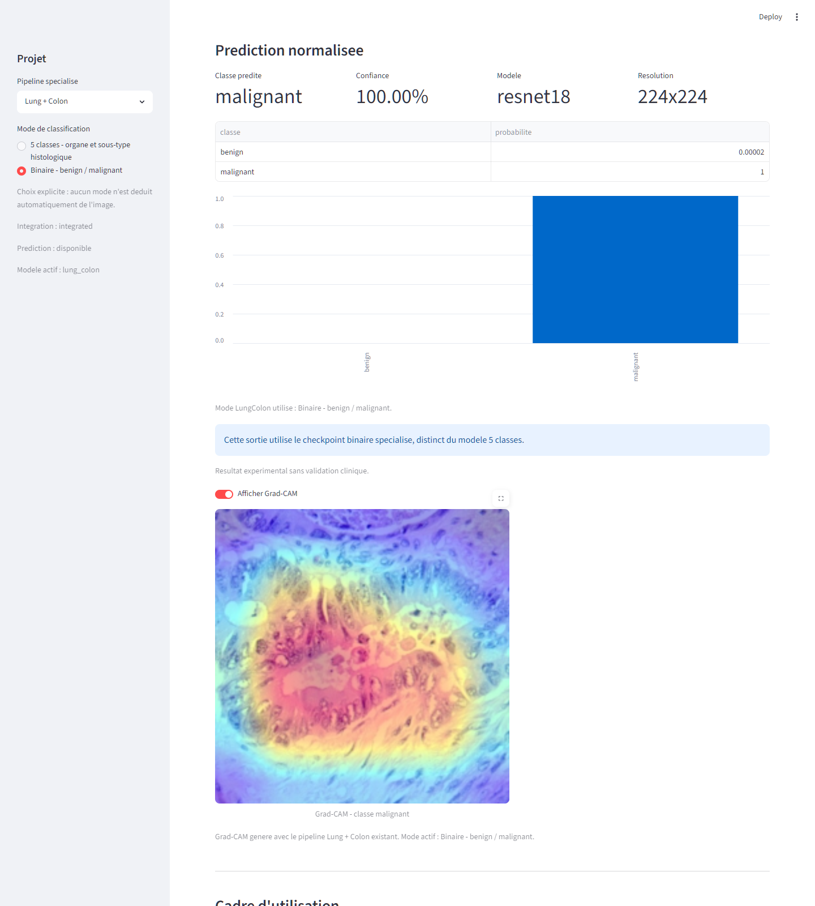

# R.C.C.I.A MultiCancer

MultiCancer est le hub final du monorepo R.C.C.I.A. Il regroupe quatre pipelines de
computer vision specialises dans une interface Streamlit commune, sans fusionner leurs
datasets, leurs classes ou leurs modeles.

> Demonstrateur educatif / portfolio uniquement. Aucune validation clinique, aucun
> diagnostic medical et aucune recommandation medicale.

## Project Status

**MultiCancer V1 complete / portfolio-ready.**

**URL historique, disponibilite non verifiee :** https://rccia-multicancer.streamlit.app/

| Version | Livrable | Statut |
| --- | --- | --- |
| V0 | Scope, registre et architecture | termine |
| V1.1 | Leukemia Adapter | termine |
| V1.2 | Breast Adapter | termine |
| V1.3 | Metastasis Adapter | termine |
| V1.4 | LungColon Adapter multiclass / binary | termine |
| V1.5 | Final QA et portfolio publishing pack | termine |

Tag de reference : `multicancer-v1`.

## Presentation

Le hub expose cinq parcours reels :

- Leukemia : `normal` / `leukemia_blast` ;
- Breast : `benign` / `malignant` ;
- Metastasis : `non_metastatic` / `metastatic` ;
- LungColon multiclass : cinq classes histologiques ;
- LungColon binary : `benign` / `malignant`.

Le projet et le mode LungColon sont toujours choisis explicitement. Le hub ne tente pas
de reconnaitre automatiquement un cancer ou une modalite.

## Pourquoi Un Hub Specialise ?

Les projets utilisent des modalites, classes, resolutions, architectures, splits et
metriques differents. Un modele universel masquerait ces ecarts et encouragerait des
comparaisons trompeuses. MultiCancer normalise l'interface, pas les taches.

## Tableau Des Projets

| Parcours | Dataset | Modele | Resolution | Particularite |
| --- | --- | --- | ---: | --- |
| Leukemia | Leukemia Classification | ResNet18 | 224 | Cellules sanguines |
| Breast | BreakHis | EfficientNet-B0 | 224 | Split patient-aware, grossissements |
| Metastasis | PCam subset | EfficientNet-B0 | 96 | ROC/PR et seuil exploratoire |
| LungColon multiclass | LC25000 | EfficientNet-B0 | 224 | Cinq classes |
| LungColon binary | LC25000 | ResNet18 | 224 | Checkpoint binaire distinct |

Les metriques restent liees au protocole de chaque sous-projet. Ce tableau n'est pas un
classement par accuracy.

## Architecture

```text
Streamlit
  -> registre du projet choisi
  -> ModelManager
  -> adaptateur specialise
  -> preprocessing + checkpoint propres au projet
  -> PredictionResult commun
  -> probabilites + Grad-CAM + limites
```

Le contrat `BaseAdapter` couvre les metadonnees, le statut checkpoint, le chargement,
la prediction, Grad-CAM et l'unload. `ModelManager` garantit un seul adaptateur actif.

## Fonctionnalites

- selection explicite du pipeline ;
- chargement paresseux et idempotent ;
- un seul modele en memoire ;
- probabilites normalisees ;
- Grad-CAM en memoire ;
- erreurs controlees pour checkpoint ou image invalide ;
- contexte methodologique par projet ;
- decision de seuil Metastasis separee de l'inference ;
- modes LungColon et checkpoints strictement separes ;
- nettoyage des sorties obsoletes lors des bascules.

## Apercu Streamlit

### Accueil



### Leukemia



### Breast



La capture Breast conserve une sortie reelle. Une confiance elevee ne garantit pas une
prediction correcte, ce qui renforce l'importance du split patient-aware et de l'analyse
d'erreurs.

### Metastasis



### LungColon





## Metriques Et Precautions

- Leukemia documente accuracy et F1 par classe sur son split public.
- Breast utilise un split patient-aware sans overlap patient et analyse les
  grossissements.
- Metastasis documente accuracy, ROC-AUC, PR-AUC, faux positifs et faux negatifs.
- LungColon documente deux taches distinctes sur LC25000.

Les scores ne sont pas directement comparables. Les performances tres elevees de
LC25000 doivent notamment etre interpretees avec prudence.

## Explicabilite

Les cinq parcours supportent Grad-CAM lorsque leur checkpoint local est present.
Grad-CAM visualise des zones influencant une prediction ; il ne fournit ni explication
causale ni preuve medicale.

## Threshold Analysis

Metastasis conserve l'argmax et les probabilites dans un `PredictionResult` immutable.
Le slider `0.30` a `0.70` derive une `ThresholdDecision` distincte. Changer le seuil
ne recharge pas le modele et ne relance pas l'inference.

Aucun seuil medical n'est recommande.

## Gestion Memoire

- un seul adaptateur actif ;
- unload avant changement de projet ;
- unload avant changement de mode LungColon ;
- nettoyage du cache CUDA si applicable ;
- suppression de la prediction, de l'image et de Grad-CAM lors d'une bascule ;
- comportement idempotent de l'unload.

## QA Et Tests

La QA finale locale a parcouru les cinq parcours avec les vrais checkpoints. Elle a
verifie la somme des probabilites, les dimensions Grad-CAM, les bascules, le seuil
Metastasis et le retour vers Leukemia sans modele residuel.

Le scenario Streamlit AppTest complet termine sans exception. Les tests couvrent aussi
les checkpoints absents, images invalides, projets/modes/seuils invalides et Grad-CAM
indisponible. La release historique `multicancer-v1` a ete validee avec **120 tests**,
dont six QA AppTest optionnels. L'audit du **20 septembre 2026** documente ensuite
**201 tests passes** sur ses correctifs locaux, avec une collecte elargie.
Ces nombres ne sont pas une validation du deploiement public. La nouvelle
[validation portfolio datee](../../docs/PORTFOLIO_VALIDATION.md) indique l'etat
teste, les resultats et les skips quand les actifs locaux sont absents.

Depuis la racine :

```powershell
.\.venv\Scripts\python.exe -m pytest -q
```

## Lancer Localement

```powershell
.\.venv\Scripts\streamlit.exe run projects\multicancer\app.py
```

Le hub reste consultable sans checkpoint. Une prediction necessite le checkpoint local
du parcours selectionne. Les poids HF sont prives : un clone ne les fournit pas.
Voir [installation et actifs requis](../../docs/LOCAL_SETUP.md).

## Public Deployment

Le Docker Space Hugging Face a ete abandonne car le compte actuel necessite un plan
payant pour ce type de Space. Le repository prive Hugging Face contenant les cinq
checkpoints est conserve.

Le packaging [Streamlit Community Cloud](../../deploy/streamlit-multicancer/README.md)
possede l'URL historique https://rccia-multicancer.streamlit.app/.
**Disponibilite actuelle non verifiee** : le dernier controle applicatif du
20 septembre 2026 signalait un acces HF refuse. La finition du 29 septembre ne
modifie aucun service distant. Le packaging reutilise le downloader existant, ne stocke
aucun checkpoint dans GitHub et conserve le lazy loading. Les cinq checkpoints restent
dans le repository prive Hugging Face et sont recuperes au demarrage du service.

Le detail de la validation publique, du cold start et des cinq parcours est documente
dans le [rapport de validation du deploiement](../../deploy/streamlit-multicancer/DEPLOYMENT_VALIDATION.md).

## Limites

- datasets publics sans validation clinique externe ;
- protocoles differents entre projets ;
- aucune comparaison globale fiable par accuracy ;
- variabilite patient importante dans BreakHis ;
- subset PCam limite ;
- scores LC25000 locaux potentiellement optimistes ;
- absence de split patient-aware documente pour Leukemia ;
- Grad-CAM uniquement exploratoire.

## Disclaimer

MultiCancer n'est pas une IA universelle de detection du cancer, un dispositif medical,
un outil de diagnostic ou une aide a la decision. Aucun resultat ne doit orienter une
decision de sante.

## Documentation

- [Project summary](docs/PROJECT_SUMMARY.md)
- [Interview pitch](docs/INTERVIEW_PITCH.md)
- [LinkedIn drafts](docs/LINKEDIN_DRAFT.md)
- [Release notes V1](docs/RELEASE_NOTES_V1.md)
- [Captures](docs/assets/README.md)
- [V1 roadmap](docs/ROADMAP_V1.md)
- [Scope](../../docs/MULTICANCER_SCOPE.md)
- [Architecture](../../docs/MULTICANCER_ARCHITECTURE.md)
- [Project matrix](../../docs/MULTICANCER_PROJECT_MATRIX.md)
- [Technical decisions](../../docs/MULTICANCER_DECISIONS.md)
- [Leukemia adapter V1.1](docs/V1_LEUKEMIA_ADAPTER.md)
- [Breast adapter V1.2](docs/V1_BREAST_ADAPTER.md)
- [Metastasis adapter V1.3](docs/V1_METASTASIS_ADAPTER.md)
- [LungColon adapter V1.4](docs/V1_LUNG_COLON_ADAPTER.md)
